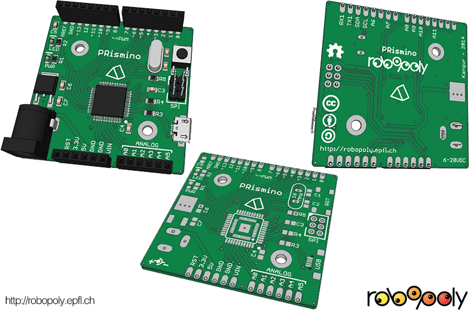

# PRismino

## Introduction
The PRismino is the 3rd generation robotics plaftorm of the [Ecole Polytechnique Fédérale de Lausanne robotics club in Switzerland: Robopoly](http://robopoly.epfl.ch/). It's based on the [Arduino Leonardo](http://arduino.cc/en/Main/ArduinoBoardLeonardo) and is made to be easely solderable as new members of the club often use it as their first soldering experience.

### Characteristics
The PRismino uses the same microcontroller as the [Arduino Leonardo](http://arduino.cc/en/Main/ArduinoBoardLeonardo): the [ATmega32U4](http://www.atmel.com/Images/doc7766.pdf) which features 32KB of flash memory, 2.5KB of SRAM and 1KB of EEPROM. It runs at 16MHz and has 4 timers: 8-bit, 2 16-bit and one a 10-bit with multiple channels each.

The board size is exactly 50 by 50mm in order to be produced as cost effectivly as possible with the [Seeedstudio Fusion](http://www.seeedstudio.com/depot/fusion-pcb-service-2-layers-p-835.html) service. Because of the board size restriction and the akward Arduino SPI port placement it was not possible to adopt the true Arduino Leonardo pinout, the [Arduino Pro](http://arduino.cc/en/Main/ArduinoBoardPro) pinout was just as good.

Electronic components are bought from [Mouser](http://ch.mouser.com/) and the connectors from [4uConnectors](http://www.4uconnector.com/).

### The kit
It is intended to be part of a kit named [_Kit PRisme_](http://robopoly.epfl.ch/prisme-en) comprising of the [Robopoly Shield](#), the [power board](#) and various sensors and accessories to build a mobile platform in order to participate at the different [challenges](http://robopoly.epfl.ch/contests) organised by the robotics club through the academic year.

### The name
The PRismino name comes from _Plateforme Robotique_ in french and _isme_ was added for _PRisme_ as it was easier to pronounce. Then _ino_ was added with the 3rd generation as it became an Arduino (but the Arduino name is copyrighted) and also because _prismino_ means _small prism_ in italian.

## Assembly
The assembly of the PRismino is [documented on the Robopoly's website](http://robopoly.epfl.ch/prisme/assemblage).

## Bootloader
Before programming the PRismino has to be loaded with a [bootloader](http://arduino.cc/en/Hacking/Bootloader?from=Main.Bootloader) that allows its flash memory to be rewritten via the USB interface. The bootloader has to be loaded in the memory via an [ISP programmer](http://en.wikipedia.org/wiki/In-system_programming). Another Arduino/PRismino board that already has the bootlaoder can be programmed to act as an ISP programmer with the [Arduino as ISP program](http://arduino.cc/en/Tutorial/ArduinoISP).

## Installing

The install process is the same as [Arduino Leonardo install](http://arduino.cc/en/Guide/ArduinoLeonardo).

## Programming
The programming is done with the [Arduino IDE](http://arduino.cc/en/Main/Software), as PRismino is basically an Arduino it's fully compatible with Arduino libraries. Use the [Arduino programming documentation](http://arduino.cc/en/Reference/HomePage) for reference,

Additionnaly to the Arduino libraries the PRismino has its own [libraries](#) to complement its function set in order to use the [Robopoly Shield](#) effectivly.

In order to use the PRismino libraries they have to be downloaded and copied to the respective folders (which varies with the operating system), see the [official guide](http://arduino.cc/en/Guide/Libraries) on how to add libraries to Arduino IDE.

The PRismino can also be programmed from Atmel Studio, see the [set-up tutorial](#). This allows for pure Assembly or C/C++ programming without the Arduino libraries.

### Atmel Studio

Programming can also be done with Atmel Studio, the official tool to program AVR microcontrollers (Windows only), the set up the programming environment for Arduino boards on Atmel Studio [follow these instructions](#). It has the main advantage of being capable of simulating the code and compiling without including the Arduino libraries and even in pure [Assembly](http://en.wikipedia.org/wiki/Assembly_language).

## Timer usage

* **Timer0**: 8-bit timer, used by Arduino for such functions as `delay()`, `millis()` and `micros()`.
* **Timer1**: 16-bit timer, used by Arduino for the Servo library.
* **Timer2**: doesn't exist on the ATmega32u4, used by the `tone()` function, since it doesn't exist a new function named `play()` and sharing the timer0 was made in the [PRismino library](#).
* **Timer3**: 16-bit timer, shares the same prescaler as timer1, not used.
* **Timer4**: 10-bit timer, used by the motors library for the shield.

## Pinout

To manage pins directly, instead of using the Arduino `digitalRead()` and `digitalWrite()` functions which add quite some overhead, use the [official ATmega32U4 pin mapping](http://arduino.cc/en/Hacking/PinMapping32u4).

For example to toggle the LED pin which is on the pin 13, but physically on the pin 7 of port C you can use:

    // set pin as output by setting the DDR (Data Direction Register) of the correcponding pin to 1 (output)
    DDRC |= (1 << 7);
    // set pin value to 1 (logical high)
    PORTC |= (1 << 7);
    // set pin value to 0 (logical low)
    PORTC &= ~(1 << 7);

## CAD files

In order to build an enclosure for the PRismino, or to build a robot chassis around it, [CAD files](#) in [Google Sketchup](http://www.sketchup.com) format are included. They're generated with [eagleUp](http://eagleup.wordpress.com/), a plugin that exports the file from [Eagle CAD](http://www.cadsoftusa.com) and imports it to Google Sketchup.

## Licence
The PRismino is published under [Creative Commons Attribution Share-Alike license](http://creativecommons.org/licenses/by-sa/3.0/).

